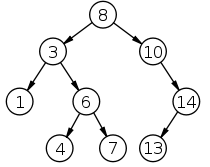
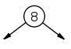
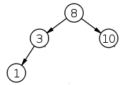
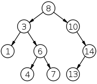
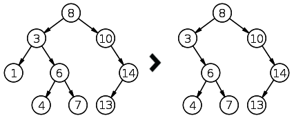
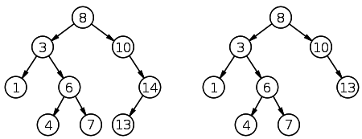
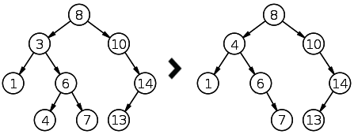

#问题

二叉树查找

#思路说明

二叉树查找是一个面对动态数据比较常用的查找算法。本文根据下面地址文章翻译，并根据本人的理解进行适当修改。

原文地址：http://www.laurentluce.com/posts/binary-search-tree-library-in-python/comment-page-1/

###二叉树查找的定义

定义内容可以参阅Wikipedia:http://en.wikipedia.org/wiki/Binary_tree

这里是中文的：http://zh.wikipedia.org/wiki/%E4%BA%8C%E5%85%83%E6%90%9C%E5%B0%8B%E6%A8%B9

摘要其中对二叉树的描述：

>>二叉树查找的性质：

>>1. 若任意节点的左子树不空，则左子树上所有结点的值均小于它的根结点的值；
>>2. 任意节点的右子树不空，则右子树上所有结点的值均大于它的根结点的值；
>>3. 任意节点的左、右子树也分别为二叉查找树。
>>4. 没有键值相等的节点（no duplicate nodes）。

>>二叉查找树相比于其他数据结构的优势在于查找、插入的时间复杂度较低。为O(log n)。二叉查找树是基础性数据结构，用于构建更为抽象的数据结构，如集合、multiset、关联数组等。

>>虽然二叉查找树的最坏效率是O(n),但它支持动态查询,且有很多改进版的二叉查找树可以使树高为O(logn),如SBT,AVL,红黑树等.

###用python实现二叉树查找

以下面图示的二叉树为例说明查找算法

**Node 类**

创建一个类，命名为Node，做为二叉树节点结构，其中包括：左枝、右枝、节点数据三个变量。

	class Node:
	    """
	    二叉树左右枝
	    """
	    def __init__(self, data):
	        """
	        节点结构
	
	        """
	        self.left = None
	        self.right = None
	        self.data = data

例如创建一个含整数8的节点。因为仅仅创建一个节点，所以左右枝都是None。

    root = Node(8)

这样就得到如下图所示的只有一个节点的树。

**插入方法**

现在已经有了一棵光秃秃的树，要有枝杈和叶子，就必须用插入数据方法，添加新的节点和数据。

    def insert(self, data):
        """
        插入节点数据
        """
        if data < self.data:
            if self.left is None:
                self.left = Node(data)
            else:
                self.left.insert(data)
        elif data > self.data:
            if self.right is None:
                self.right = Node(data)
            else:
                self.right.insert(data)

承接前面的操作，可以用下面的方式增加树的枝杈和叶子（左右枝以及节点数据）。

    root.insert(3)
    root.insert(10)
    root.insert(1)

当增加了第二个节点数据3,程序会：

- 第一步，root会调用insert()，其参数是data=3
- 第二步，比较3和8（已有的根节点），3比8小。并且树的左枝还是None，于是就在左边建立一个新的节点。

增加第三个节点数据10,程序会：

- 第一步，跟前面的第一步一样，只不过data=10
- 第二步，发现10大于8,同时右边是None,于是就把它做为右边新建分支的节点数据。

增加第四个节点数据1,程序会：

- 第一步，同前，data=1
- 第二步，1小于8,所以要放在树的左枝；
- 第三步，左枝已经有子节点3,该节点再次调用insert()方法，1小于3,所以1就做为3的子节点，且放在原本就是None的左侧。

如此，就形成了下图的树

继续增加节点数据

    root.insert(6)
    root.insert(4)
    root.insert(7)
    root.insert(14)
    root.insert(13)

最终形成下图的树

**遍历树**

此方法用于查找树中的某个节点，如果找到了，就返回该节点，否则返回None。为了方便，也返回父节点。

    def lookup(self, data, parent=None):
        """
        遍历二叉树
        """
        if data < self.data:
            if self.left is None:
                return None, None
            return self.left.lookup(data, self)
        elif data > self.data:
            if self.right is None:
                return None, None
            return self.right.lookup(data, self)
        else:
            return self, parent

测试一下，找一找数据为6的节点

    node, parent = root.lookup(6)

调用lookup()后，程序会这么干：

1. 调用lookup()，传递参数data=6,默认parent=None
2. data=6，小于根节点的值8
3. 指针转到根节点左侧，此时:data=6,parent=8,再次调用lookup()
4. data=6大于左侧第一层节点数据3
5. 指针转到3的右侧分支，data=6,parent=3,再次调用lookup()
6. 节点数据等于6,于是返回这个节点和它的父节点3

**删除方法**

删除节点数据。代码如下：

    def delete(self, data):
        """
        删除节点
        """
        node, parent = self.lookup(data)        #已有节点
        if node is not None:
            children_count = node.children_count()      #判断子节点数
            if children_count == 0:
                # 如果该节点下没有子节点，即可删除
                if parent.left is node:
                    parent.left = None
                else:
                    parent.right = None
                del node
            elif children_count == 1:
                # 如果有一个子节点，则让子节点上移替换该节点（该节点消失)
                if node.left:
                    n = node.left
                else:
                    n = node.right
                if parent:
                    if parent.left is node:
                        parent.left = n
                    else:
                        parent.right = n
                del node
            else:
                # 如果有两个子节点，则要判断节点下所有叶子
                parent = node
                successor = node.right
                while successor.left:
                    parent = successor
                    successor = successor.left
                node.data = successor.data
                if parent.left == successor:
                    parent.left = successor.right
                else:
                    parent.right = successor.right

在上述方法中，得到当前节点下的子节点数目后，需要进行三种情况的判断

- 如果没有子节点，直接删除
- 如果有一个子节点，要将下一个子节点上移到当前节点，即替换之
- 如果有两个子节点，要对自己点的数据进行判断，并从新安排节点排序

上述方法中用到了统计子节点数目的方法，代码如下：

    def children_count(self):
        """
        子节点个数
        """
        cnt = 0
        if self.left:
            cnt += 1
        if self.right:
            cnt += 1
        return cnt

例1：删除数据为1的节点，它是3的子节点，1后面没有子节点

    root.delete(1)

例2：删除数据为14的节点，它是10的子节点，它下面有唯一一个子节点13,13替换之。

    root.delete(14)

例3：来个复杂的，删除节点数据为3的节点，它下面有两个节点，而节点6下面又有两个4,7。需要一个临时变量successor，将节点3下面的子节点进行查询，并把小于3下面的第一级子节点6左测节点数据4（该数据一定小于其父节点6）替换当前节点3，维持二叉树结构。如下图：
    
    root.delete(3)

**比较两个二叉树**

比较两个二叉树的方法中，只要有一个节点（叶子）与另外一个树的不同，就返回False，也包括缺少对应叶子的情况。

    def compare_trees(self, node):
        """
        比较两棵树
        """
        if node is None:
            return False
        if self.data != node.data:
            return False
        res = True
        if self.left is None:
            if node.left:
                return False
        else:
            res = self.left.compare_trees(node.left)
        if res is False:
            return False
        if self.right is None:
            if node.right:
                return False
        else:
            res = self.right.compare_trees(node.right)
        return res

例如，比较tree(3,8,10)和tree(3,8,11)

    #root2 是tree(3,8,11)的根
    #root 是tree(3,8,10)的根
    root.compare_trees(root2)

执行上面的代码，程序会这么走：

1. root调用compare_trees()方法
2. root有左侧子节点，调用该节点的compare_trees()
3. 两个左侧子节点比较，返回true
4. 按照前面的过程，比较右侧节点，发现不同，则返回False

**打印树**

把二叉树按照一定的顺序打印出来。不需要参数了。做法就是先左后右（左小于右）。

    def print_tree(self):
        """
        按顺序打印数的内容
        """
        if self.left:
            self.left.print_tree()
        print self.data,
        if self.right:
            self.right.print_tree()

操作一下：

    root.print_tree()

输出： 1, 3, 4, 6, 7, 8, 10, 13, 14

**包含所有树元素的生成器**

创建一个包含所有树元素的生成器，有时候是有必要的。考虑到内存问题，没有必要实时生成所有节点数据列表，而是要每次调用此方法时，它返回的下一个节点的值。为此，使用它返回一个对象，并停止在那里，那么该函数将在下一次调用方法时从那里继续通过yield关键字返回值。在这种情况下，要使用堆栈，不能使用递归。

    def tree_data(self):
        """
        二叉树数据结构
        """
        stack = []
        node = self
        while stack or node: 
            if node:
                stack.append(node)
                node = node.left
            else: 
                node = stack.pop()
                yield node.data
                node = node.right

举例，通过循环得到树：

    for data in root.tree_data():
        print data

程序会按照先左后右边的原子将数据入栈、出栈，顺序取出值，并返回结果
