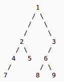

#问题

用递归方式遍历二叉树

#思路说明

遍历二叉树的方法有广度优先和深度优先两类，下面阐述的是深度优先。

以下图的二叉树为例：

先定义三个符号标记：

- 访问结点本身（N）
- 遍历该结点的左子树（L）
- 遍历该结点的右子树（R）

有四种方式：

1. 前序遍历(PreorderTraversal,NLR):先访问根结点，然后遍历其左右子树
2. 中序遍历(InorderTraversal,LNR):先访问左子树，然后访问根节点，再访问右子树
3. 后序遍历(PostorderTraversal,LRN):先访问左右子树，再访问根结点
4. 层序遍历(levelorderTraversal):按照从上到下的层顺序访问

上面的数，按照以上四种方式遍历，得到的结果依次是：

1. preorder:    1 2 4 7 5 3 6 8 9
2. inorder:     7 4 2 5 1 8 6 9 3
3. postorder:   7 4 5 2 8 9 6 3 1
4. level-order: 1 2 3 4 5 6 7 8 9

下面用递归的方式，解决此题。

#解决(Python)
	
	#! /usr/bin/env python
	#coding:utf-8
	
	from collections import namedtuple
	from sys import stdout
	 
	Node = namedtuple('Node', 'data, left, right')
	tree = Node(1,
	            Node(2,
	                 Node(4,
	                      Node(7, None, None),
	                      None),
	                 Node(5, None, None)),
	            Node(3,
	                 Node(6,
	                      Node(8, None, None),
	                      Node(9, None, None)),
	                 None))
	
	
	#前序（pre-order，NLR）
	
	def preorder(node):
	    if node is not None:
	        print node.data,
	        preorder(node.left)
	        preorder(node.right)
	
	
	#中序（in-order，LNR）
	
	def inorder(node):
	    if node is not None:
	        inorder(node.left)
	        print node.data,
	        inorder(node.right)
	
	
	#后序（post-order，LRN）
	
	def postorder(node):
	    if node is not None:
	        postorder(node.left)
	        postorder(node.right)
	        print node.data,
	
	
	#层序（level-order）
	
	def levelorder(node, more=None):
	    if node is not None:
	        if more is None:
	            more = []
	        more += [node.left, node.right]
	        print node.data,
	    if more:    
	        levelorder(more[0], more[1:])
	
	if __name__=="__main__"
	    print '  preorder: ',
	    preorder(tree)
	    print '\t\n   inorder: ',
	    inorder(tree)
	    print '\t\n postorder: ',
	    postorder(tree)
	    print '\t\nlevelorder: ',
	    levelorder(tree)
	    print '\n'
