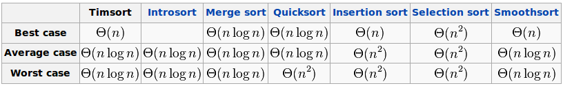
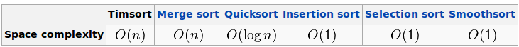

#python的排序详解

排序，在编程中经常遇到的算法，我也在几篇文章中介绍了一些关于排序的算法。有的高级语言内置了一些排序函数。本文讲述Python在这方面的工作。供使用python的程序员们参考，也让没有使用python的朋友了解python。领略一番“生命有限，请用Python”的含义。

##内置函数sorted()/list.sort()的使用

###简单应用

python对list有一个内置函数：sorted(),专门用于排序。举例：

	>>> a=[5,3,6,1,9,2]
	>>> sorted(a)       #a经过sorted之后，得到一个排序结果
	[1, 2, 3, 5, 6, 9]  #但是，原有的a并没有受到影响
	>>> a
	[5, 3, 6, 1, 9, 2]

也可以使用list.sort()来进行上述操作。

    >>> a.sort()
    >>> a               #注意这里，经过list.sort()之后，原有
    [1, 2, 3, 5, 6, 9]  #a的顺序已经发生变化，与上述不同之处。

**sorted和list.sort()的区别:**list.sort()只能对list类型进行排序。如下：

    >>> b_dict={1:'e',3:'m',9:'a',5:'e'}
    >>> b_dict.sort()
    Traceback (most recent call last):
      File "<stdin>", line 1, in <module>
      AttributeError: 'dict' object has no attribute 'sort'

而sorted则不然，看例子：

    >>> b_dict
    {1: 'e', 3: 'm', 5: 'e', 9: 'a'}
    >>> sorted(b_dict)
    [1, 3, 5, 9]

sorted之后，上述对dictinoary中，将key值取出并排序，返回list类型的排序结果。

###按照指定关键词排序

在list.sort()和sorted中，都可以根据指定的key值排序。例如：

sorted的例子：

    >>> qw="I am Qiwsir you can read my articles im my blog".split()
    >>> qw
    ['I', 'am', 'Qiwsir', 'you', 'can', 'read', 'my', 'articles', 'im', 'my', 'blog']
    >>> sorted(qw,key=str.lower)        #按照字母升序排列
    ['am', 'articles', 'blog', 'can', 'I', 'im', 'my', 'my', 'Qiwsir', 'read', 'you']

list.sort()的例子：
    
    >>> qw  
    ['I', 'am', 'Qiwsir', 'you', 'can', 'read', 'my', 'articles', 'im', 'my', 'blog']
    >>> qw.sort(key=str.lower)
    >>> qw
    ['am', 'articles', 'blog', 'can', 'I', 'im', 'my', 'my', 'Qiwsir', 'read', 'you']

此外，key还可以接收函数的单一返回值，按照该值排序。例如：

    >>> name_mark_age = [('zhangsan','A',15),('LISI','B',14),('WANGWU','A',16)]
    >>> sorted(name_mark_age, key = lambda x: x[2])     #根据年龄排序
    [('LISI', 'B', 14), ('zhangsan', 'A', 15), ('WANGWU', 'A', 16)]

    >>> sorted(name_mark_age, key = lambda x: x[1])     #根据等级排序
    [('zhangsan', 'A', 15), ('WANGWU', 'A', 16), ('LISI', 'B', 14)]
    
    >>> sorted(name_mark_age, key = lambda x: x[0])     #根据姓名排序
    [('LISI', 'B', 14), ('WANGWU', 'A', 16), ('zhangsan', 'A', 15)]

除了上述方式，python中还提供了一个选择循环选择指定元组值的模块

    >>> from operator import itemgetter    #官方文档：https://docs.python.org/2/library/operator.html#module-operator
	>>> name_mark_age.append(('zhaoliu','B',16))
	>>> name_mark_age
	[('zhangsan', 'A', 15), ('LISI', 'B', 14), ('WANGWU', 'A', 16), ('zhaoliu', 'B', 16)]
	
    >>> sorted(name_mark_age,key=itemgetter(2))     #按照年龄排序
	[('LISI', 'B', 14), ('zhangsan', 'A', 15), ('WANGWU', 'A', 16), ('zhaoliu', 'B', 16)]

	>>> sorted(name_mark_age,key=itemgetter(1,2))   #先按照等级排序，相同等级看年龄
	[('zhangsan', 'A', 15), ('WANGWU', 'A', 16), ('LISI', 'B', 14), ('zhaoliu', 'B', 16)]

在官方文档上，有这样一个例子，和上面的操作是完全一样的。

    >>> class Student:
            def __init__(self, name, grade, age):
                self.name = name
                self.grade = grade
                self.age = age
            
            def __repr__(self):
                return repr((self.name, self.grade, self.age))
            
    >>> student_objects = [
            Student('john', 'A', 15),       #注意这里，用class Student来生成列表内的值
            Student('jane', 'B', 12),       #因此，可以通过student_objects[i].age来访问某个名称的年龄,i=0,则是john的年龄
            Student('dave', 'B', 10),
            ]
            
    >>> sorted(student_objects, key=lambda student: student.age)
    [('dave', 'B', 10), ('jane', 'B', 12), ('john', 'A', 15)]

也可以引用operator模块来实现上述排序
    
    >>>from operator import attrgetter
    >>> sorted(student_objects, key=attrgetter('age'))
    [('dave', 'B', 10), ('jane', 'B', 12), ('john', 'A', 15)]
    >>> sorted(student_objects, key=attrgetter('grade', 'age'))
    [('john', 'A', 15), ('dave', 'B', 10), ('jane', 'B', 12)]

**总结：**sorted的能力超强，不仅实现排序，还能按照指定关键词排序。

以上例子都是升序，如果，增加reverse=True。例如：

    >>>from operator import itemgetter 
    >>> name_mark_age
    [('zhangsan', 'A', 15), ('LISI', 'B', 14), ('WANGWU', 'A', 16), ('zhaoliu', 'B', 16)]
    >>> sorted(name_mark_age, key=itemgetter(2),reverse=True)
    [('WANGWU', 'A', 16), ('zhaoliu', 'B', 16), ('zhangsan', 'A', 15), ('LISI', 'B', 14)]

##sorted的算法

python中的sorted算法，网上有人撰文，说比较低级。其实不然，通过阅读官方文档，发现python中的sorted排序，真的是高大上，用的Timsort算法。什么是Timsort，请看 wiki的解释：http://en.wikipedia.org/wiki/Timsort，另外，国内有一个文档，适当翻译：http://blog.csdn.net/yangzhongblog/article/details/8184707，这里截取一个不同排序算法比较的图示，就明白sorted的威力了。

从时间复杂度来看，Timsort是威武的。

从空间复杂度来讲，需要的开销在数量大的时候会增大。

综上，可以看出，就一般情况，使用sorted足以能够完成排序的要求，并且是稳定的。

当然，python中也有其它一些排序模块，都可以直接拿过来使用。

本文作者在博客和github上都有多种关于python排序方法和模块的文章说明。
